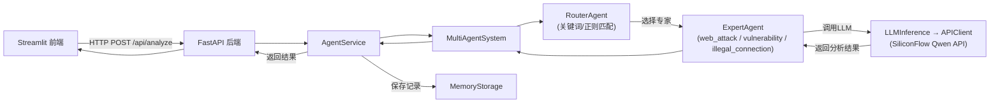
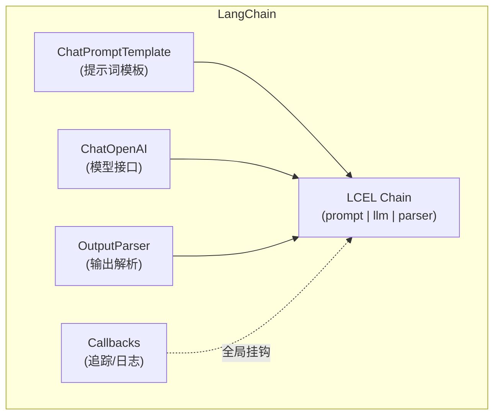
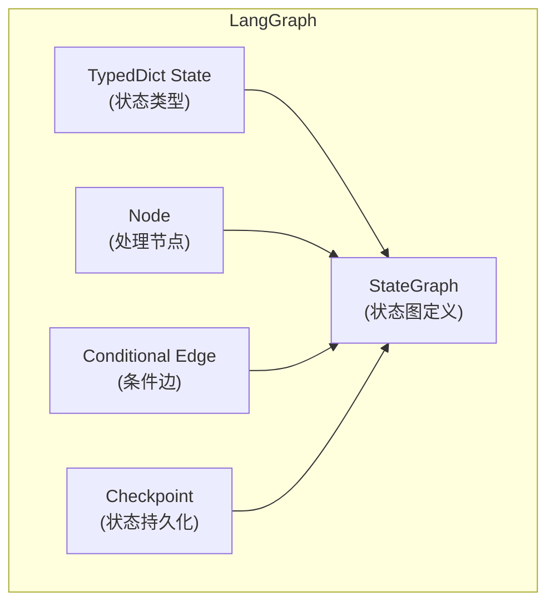
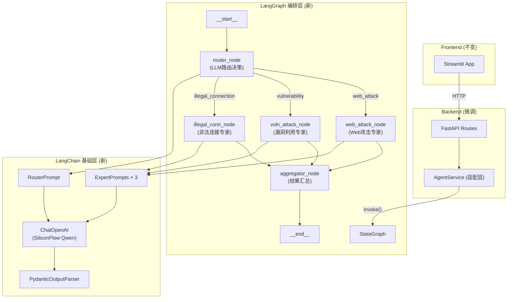

# 使用 LangChain + LangGraph 重构多智能体安全分析系统 — 完整教程

## 目录

1. [现有架构分析](#1-现有架构分析)
2. [LangChain & LangGraph 核心概念](#2-langchain--langgraph-核心概念)
3. [重构目标与新架构设计](#3-重构目标与新架构设计)
4. [环境准备](#4-环境准备)
5. [第一阶段：LangChain 基础层重构](#5-第一阶段langchain-基础层重构)
6. [第二阶段：LangGraph 状态图构建](#6-第二阶段langgraph-状态图构建)
7. [第三阶段：后端服务层适配](#7-第三阶段后端服务层适配)
8. [第四阶段：前端无缝对接](#8-第四阶段前端无缝对接)
9. [第五阶段：高级特性扩展](#9-第五阶段高级特性扩展)
10. [测试与验证策略](#10-测试与验证策略)
11. [迁移检查清单](#11-迁移检查清单)

---

## 1. 现有架构分析

### 1.1 项目结构总览

```
multi-agent-security-analysis-main/
├── src/                          # 核心业务逻辑
│   ├── agents/
│   │   ├── optimized_system.py   # MultiAgentSystem —— 系统协调器
│   │   ├── optimized_router.py   # OptimizedRouterAgent —— 路由智能体
│   │   └── optimized_expert.py   # OptimizedExpertAgent —— 专家智能体
│   ├── models/
│   │   ├── api_client.py         # APIClient —— SiliconFlow/Qwen HTTP 客户端
│   │   └── llm_inference.py      # LLMInference —— LLM 推理封装
│   └── utils/
│       ├── config.py             # 配置管理
│       └── structured_logger.py  # 结构化日志
├── backend/                      # FastAPI 后端
│   ├── main.py                   # FastAPI 应用入口
│   ├── config.py                 # 后端配置
│   ├── api/
│   │   ├── models/schemas.py     # Pydantic 数据模型
│   │   └── routes/
│   │       ├── analysis.py       # 分析 API 路由
│   │       └── stats.py          # 统计 API 路由
│   └── services/
│       ├── agent_service.py      # 智能体服务层
│       └── memory_storage.py     # 内存存储
└── frontend/                     # Streamlit 前端
    ├── app.py                    # 主应用
    ├── pages/                    # 功能页面
    └── utils/api_client.py       # 前端 HTTP 客户端
```

### 1.2 现有数据流



### 1.3 关键问题与重构动机

| 现有实现 | 问题 | LangChain/LangGraph 解决方案 |
|---------|------|---------------------------|
| `APIClient` 手动构建 HTTP 请求 | 与 SiliconFlow API 强耦合，换模型需改代码 | `ChatOpenAI` 统一接口，一行切换模型 |
| `OptimizedRouterAgent` 基于关键词/正则路由 | 路由不智能，硬编码规则，无法学习 | LLM + 结构化输出做智能路由 |
| `OptimizedExpertAgent` 手动拼接 Prompt | Prompt 管理散乱，无模板化 | `ChatPromptTemplate` 统一管理 |
| `_parse_response` 手动解析 JSON | 脆弱，LLM 输出格式不定 | `PydanticOutputParser` + `with_structured_output` |
| `MultiAgentSystem.analyze()` 线性硬编码流程 | 无法动态调整流程，扩展困难 | `StateGraph` 声明式有向图流程 |
| 全局单例模式管理状态 | 测试困难，耦合严重 | LangGraph 内置状态管理 |
| 无对话记忆 | 每次分析互相独立 | LangGraph `MemorySaver` 持久化 |

---

## 2. LangChain & LangGraph 核心概念

### 2.1 LangChain 关键组件



- **`ChatOpenAI`**：兼容 OpenAI 接口的 LLM 包装器，可对接 SiliconFlow/Qwen
- **`ChatPromptTemplate`**：结构化 Prompt 管理，支持 System/Human/AI 消息角色
- **`PydanticOutputParser`**：将 LLM 输出自动解析为 Pydantic 模型
- **LCEL（LangChain Expression Language）**：`prompt | llm | parser` 管道语法
- **Callbacks**：可插拔的日志追踪钩子

### 2.2 LangGraph 关键组件



- **`StateGraph`**：声明式有向图，定义 Agent 工作流
- **`TypedDict`**：强类型状态定义，让每个节点读写统一状态
- **Node（节点）**：图中每个处理步骤，对应一个函数
- **Conditional Edge（条件边）**：基于状态动态决定下一步走向
- **`MemorySaver`**：内置检查点机制，支持对话记忆和流程恢复

---

## 3. 重构目标与新架构设计

### 3.1 新架构总览



### 3.2 重构后的目录结构

```
multi-agent-security-analysis-main/
├── src/
│   ├── agents/                    # 重构
│   │   ├── __init__.py
│   │   ├── state.py               # [NEW] LangGraph 状态定义
│   │   ├── graph.py               # [NEW] StateGraph 构建与编译
│   │   ├── nodes/                 # [NEW] 图节点
│   │   │   ├── __init__.py
│   │   │   ├── router.py          # [NEW] 路由节点（替代 optimized_router.py）
│   │   │   ├── experts.py         # [NEW] 专家节点（替代 optimized_expert.py）
│   │   │   └── aggregator.py      # [NEW] 结果汇总节点
│   │   ├── prompts/               # [NEW] Prompt 模板集中管理
│   │   │   ├── __init__.py
│   │   │   ├── router_prompt.py
│   │   │   └── expert_prompts.py
│   │   └── output_schemas.py      # [NEW] 输出 Pydantic 模型
│   ├── models/                    # 重构
│   │   ├── __init__.py
│   │   └── llm_factory.py         # [NEW] LLM 工厂（替代 api_client.py + llm_inference.py）
│   └── utils/                     # 基本保留
│       ├── config.py              # 微调
│       └── structured_logger.py   # 可选：改为 LangChain Callback 方式
├── backend/                       # 微调适配
│   ├── main.py                    # 微调
│   ├── config.py                  # 微调
│   ├── api/ ...                   # 基本不变
│   └── services/
│       ├── agent_service.py       # 重构：调用 graph.invoke()
│       └── memory_storage.py      # 保留
├── frontend/                      # 基本不变
└── requirements.txt               # 更新依赖
```

### 3.3 文件映射关系

| 旧文件 | 新文件 | 变化说明 |
|--------|--------|---------|
| `src/models/api_client.py` | `src/models/llm_factory.py` | httpx 手动调用 → `ChatOpenAI` |
| `src/models/llm_inference.py` | `src/models/llm_factory.py` | 合并到 LLM 工厂 |
| `src/agents/optimized_router.py` | `src/agents/nodes/router.py` | 关键词匹配 → LLM 智能路由 |
| `src/agents/optimized_expert.py` | `src/agents/nodes/experts.py` | 手动 prompt → `ChatPromptTemplate` |
| `src/agents/optimized_system.py` | `src/agents/graph.py` | 线性流程 → `StateGraph` |
| *(无)* | `src/agents/state.py` | 新增：统一状态定义 |
| *(无)* | `src/agents/nodes/aggregator.py` | 新增：结果汇总节点 |
| *(无)* | `src/agents/prompts/*.py` | 新增：集中管理 Prompt |
| *(无)* | `src/agents/output_schemas.py` | 新增：结构化输出模型 |

---

## 4. 环境准备

### 4.1 安装依赖

在 `requirements.txt` 中新增以下依赖：

```diff
 # 核心依赖（必需）
 python-dotenv==1.0.0
-openai==1.12.0
 loguru==0.7.2

+# LangChain 核心
+langchain>=0.3.0
+langchain-openai>=0.3.0
+langchain-core>=0.3.0

+# LangGraph
+langgraph>=0.2.0

 # 后端依赖
 fastapi==0.115.0
 uvicorn[standard]==0.32.0
 pydantic==2.9.0
-httpx==0.27.0
+httpx==0.27.0       # langchain-openai 内部也用到

 # 前端依赖
 streamlit==1.40.0
 plotly==5.24.0
 pandas==2.2.0
 requests==2.32.0
-
-# 异步支持
-aiohttp==3.10.0
```

安装命令：

```bash
pip install langchain langchain-openai langchain-core langgraph
```

### 4.2 验证安装

```python
# 运行这段代码确认安装成功
import langchain
import langgraph
from langchain_openai import ChatOpenAI

print(f"LangChain: {langchain.__version__}")
print(f"LangGraph: {langgraph.__version__}")
print("✅ 安装成功")
```

### 4.3 环境变量

`.env` 文件无需大改，但建议规范化变量名：

```env
# 现有变量（继续使用）
LLM_API_KEY="sk-your-key"
MODEL_NAME="Qwen/Qwen3-30B-A3B-Thinking-2507"
MODEL_URL="https://api.siliconflow.cn/v1"
EMBEDDING_MODEL_NAME="Qwen/Qwen3-Embedding-0.6B"
```

> [!TIP]
> `ChatOpenAI` 的 `base_url` 参数直接对应 `MODEL_URL`，`api_key` 对应 `LLM_API_KEY`，`model` 对应 `MODEL_NAME`。SiliconFlow 兼容 OpenAI 接口格式，因此可直接用 `ChatOpenAI`。

---

## 5. 第一阶段：LangChain 基础层重构

本阶段将 `api_client.py` + `llm_inference.py` 替换为基于 LangChain 的统一 LLM 接口。

### 5.1 创建 LLM 工厂 — `src/models/llm_factory.py`

这个文件替代现有的 `api_client.py` 和 `llm_inference.py`。

```python
#!/usr/bin/env python3
"""
LLM 工厂模块
使用 LangChain ChatOpenAI 替代手动 HTTP 调用
"""
import os
from functools import lru_cache
from dotenv import load_dotenv
from langchain_openai import ChatOpenAI

load_dotenv()


@lru_cache(maxsize=1)
def get_llm(
    temperature: float = 0.3,
    max_tokens: int = 512
) -> ChatOpenAI:
    """
    获取 LLM 实例（单例缓存）
    
    关键对应关系：
    - 旧 APIClient.__init__ 的 self.api_key → api_key 参数
    - 旧 APIClient.__init__ 的 self.base_url → base_url 参数
    - 旧 APIClient.__init__ 的 self.model_name → model 参数
    """
    return ChatOpenAI(
        api_key=os.getenv("LLM_API_KEY"),
        base_url=os.getenv("MODEL_URL", "https://api.siliconflow.cn/v1"),
        model=os.getenv("MODEL_NAME", "Qwen/Qwen3-30B-A3B-Thinking-2507"),
        temperature=temperature,
        max_tokens=max_tokens,
    )
```

> [!IMPORTANT]
> **对比旧代码的变化**：
> - 旧 `APIClient.generate()` 方法需要手动构建 `{"model": ..., "messages": [...]}` payload，手动发 HTTP POST，手动解析 `response.json()["choices"][0]["message"]["content"]`
> - 新代码直接 `llm.ainvoke(messages)` 即可，LangChain 自动处理所有细节
> - 旧的全局单例 `_GLOBAL_CLIENT` / `_llm_instance` 被 `@lru_cache` 替代，更加 Pythonic

### 5.2 创建输出结构定义 — `src/agents/output_schemas.py`

用 Pydantic 模型定义 LLM 的期望输出格式，替代手动 JSON 解析。

```python
#!/usr/bin/env python3
"""
LLM 输出结构定义
替代旧 ExpertAgent._parse_response() 的手动 JSON 解析
"""
from typing import List, Literal
from pydantic import BaseModel, Field


class RouterDecision(BaseModel):
    """路由决策输出 — 替代旧 RouterAgent 的关键词/正则匹配"""
    selected_route: Literal["web_attack", "vulnerability_attack", "illegal_connection"] = Field(
        description="选择的路由类型"
    )
    confidence: float = Field(
        description="路由置信度(0-1)",
        ge=0.0, le=1.0
    )
    reasoning: str = Field(
        description="路由决策理由"
    )


class ExpertAnalysisOutput(BaseModel):
    """专家分析输出 — 替代旧 ExpertAgent._parse_response() 的手动解析"""
    attack_technique: str = Field(description="攻击技术名称")
    risk_score: float = Field(description="风险评分(0-10)", ge=0.0, le=10.0)
    threat_level: Literal["高危", "中危", "低危"] = Field(description="威胁等级")
    recommendations: List[str] = Field(description="防御建议列表")
    analysis: str = Field(description="详细分析说明")
```

> [!NOTE]
> **为什么比旧代码更好？**
> - 旧代码 `_parse_response()` 用 `response.find('{')` 和 `json.loads()` 做脆弱的 JSON 提取
> - 新代码用 `llm.with_structured_output(ExpertAnalysisOutput)` 让 LLM 直接输出符合 schema 的结构化数据
> - 如果 LLM 输出格式不对，LangChain 会自动重试纠正

### 5.3 创建 Prompt 模板 — `src/agents/prompts/`

集中管理所有 Prompt 模板，替代旧代码中散落在 `OptimizedExpertAgent.__init__` 里的字符串。

#### `src/agents/prompts/router_prompt.py`

```python
#!/usr/bin/env python3
"""路由 Prompt 模板"""
from langchain_core.prompts import ChatPromptTemplate

# 路由决策 Prompt
# 旧代码中没有专门的路由 Prompt，路由靠关键词/正则匹配
# 重构后改为 LLM 智能路由
ROUTER_PROMPT = ChatPromptTemplate.from_messages([
    ("system", """你是一个网络安全告警路由专家。你的任务是根据告警信息，将其路由到最合适的专家进行分析。

可选的路由类型：
- web_attack: Web攻击（SQL注入、XSS、目录遍历、WebShell等）
- vulnerability_attack: 漏洞利用攻击（CVE漏洞、缓冲区溢出、ShellCode等）
- illegal_connection: 非法连接（C2通信、僵尸网络、DDoS、代理隧道等）

请根据攻击类型和载荷内容做出路由决策。"""),
    ("human", """告警信息：
攻击类型: {attack_type}
载荷内容: {payload}
源IP: {source_ip}
目标IP: {dest_ip}

请做出路由决策。""")
])
```

#### `src/agents/prompts/expert_prompts.py`

```python
#!/usr/bin/env python3
"""专家 Prompt 模板集合"""
from langchain_core.prompts import ChatPromptTemplate

# 这三个 Prompt 分别对应旧代码 OptimizedExpertAgent.prompt_templates 字典中的三个模板
# 区别是：旧代码用 Python format 字符串，新代码用 ChatPromptTemplate 管理角色消息

WEB_ATTACK_PROMPT = ChatPromptTemplate.from_messages([
    ("system", "你是一位资深的Web安全专家，擅长分析SQL注入、XSS、CSRF、命令注入等各类Web攻击。"),
    ("human", """请分析以下Web攻击告警：

攻击类型: {attack_type}
载荷内容: {payload}

请给出完整的安全分析，包括攻击技术、风险评分、威胁等级和防御建议。""")
])

VULNERABILITY_ATTACK_PROMPT = ChatPromptTemplate.from_messages([
    ("system", "你是一位专注于漏洞分析的安全专家，擅长CVE漏洞分析、缓冲区溢出检测和漏洞利用技术评估。"),
    ("human", """请分析以下漏洞利用攻击：

攻击类型: {attack_type}
载荷内容: {payload}

请给出完整的安全分析，包括漏洞类型、利用技术、风险评分和修复建议。""")
])

ILLEGAL_CONNECTION_PROMPT = ChatPromptTemplate.from_messages([
    ("system", "你是一位网络安全通信专家，擅长C2通信检测、僵尸网络识别、隧道通信分析和DDoS攻击评估。"),
    ("human", """请分析以下可疑网络连接：

攻击类型: {attack_type}
载荷内容: {payload}
源IP: {source_ip}
目标IP: {dest_ip}

请给出完整的安全分析，包括连接类型、胁评估、风险评分和响应建议。""")
])

# Prompt 映射表（与旧代码 prompt_templates 字典对应）
EXPERT_PROMPTS = {
    "web_attack": WEB_ATTACK_PROMPT,
    "vulnerability_attack": VULNERABILITY_ATTACK_PROMPT,
    "illegal_connection": ILLEGAL_CONNECTION_PROMPT,
}
```

---

## 6. 第二阶段：LangGraph 状态图构建

这是重构的核心，将旧的 `MultiAgentSystem` 线性流程改为 LangGraph 声明式状态图。

### 6.1 定义图状态 — `src/agents/state.py`

```python
#!/usr/bin/env python3
"""
LangGraph 状态定义
替代旧代码中 MultiAgentSystem.analyze() 方法内的临时变量传递
"""
from typing import TypedDict, Optional, List, Any


class SecurityAnalysisState(TypedDict):
    """安全分析流程的统一状态

    旧代码的 MultiAgentSystem.analyze() 方法中，数据通过局部变量逐步传递：
        routing_result = await self.router.route(alert_data)
        expert_result = await expert.analyze(alert_data)
        final_result = { ... }
    
    重构后，所有中间状态统一放在这个 TypedDict 中，
    每个 LangGraph 节点读写同一个 state 对象。
    """
    # 输入
    attack_type: str
    payload: str
    source_ip: str
    dest_ip: str
    protocol: str
    additional_info: Optional[dict]
    task_id: str
    
    # 路由结果（由 router_node 写入）
    selected_route: Optional[str]
    routing_confidence: Optional[float]
    routing_reasoning: Optional[str]
    routing_time_ms: Optional[int]
    
    # 专家分析结果（由 expert_node 写入）
    attack_technique: Optional[str]
    risk_score: Optional[float]
    threat_level: Optional[str]
    recommendations: Optional[List[str]]
    expert_analysis: Optional[str]
    expert_time_ms: Optional[int]
    
    # 最终汇总（由 aggregator_node 写入）
    final_result: Optional[dict]
    total_time_ms: Optional[int]
```

### 6.2 实现图节点 — `src/agents/nodes/`

每个节点就是一个 `(state) -> state` 的函数，对应旧代码中的一个处理阶段。

#### `src/agents/nodes/router.py` — 路由节点

```python
#!/usr/bin/env python3
"""
路由节点 — 替代 OptimizedRouterAgent
旧代码：关键词匹配 + 正则表达式打分
新代码：LLM 智能路由 + 结构化输出
"""
import time
from src.agents.state import SecurityAnalysisState
from src.agents.prompts.router_prompt import ROUTER_PROMPT
from src.agents.output_schemas import RouterDecision
from src.models.llm_factory import get_llm


async def router_node(state: SecurityAnalysisState) -> dict:
    """
    路由决策节点
    
    对比旧 OptimizedRouterAgent.route():
    - 旧: 遍历 routing_rules，计算关键词/正则匹配分数，选分数最高的
    - 新: 将告警信息发给 LLM，让 LLM 做智能路由决策
    """
    start_time = time.time()
    
    # 构建 LLM Chain，使用结构化输出
    llm = get_llm()
    structured_llm = llm.with_structured_output(RouterDecision)
    chain = ROUTER_PROMPT | structured_llm
    
    # 调用 LLM 做路由决策
    decision: RouterDecision = await chain.ainvoke({
        "attack_type": state["attack_type"],
        "payload": state["payload"][:500],  # 与旧代码一致，限制长度
        "source_ip": state.get("source_ip", "unknown"),
        "dest_ip": state.get("dest_ip", "unknown"),
    })
    
    processing_time_ms = int((time.time() - start_time) * 1000)
    
    # 返回更新的状态字段
    return {
        "selected_route": decision.selected_route,
        "routing_confidence": decision.confidence,
        "routing_reasoning": decision.reasoning,
        "routing_time_ms": processing_time_ms,
    }
```

#### `src/agents/nodes/experts.py` — 专家节点

```python
#!/usr/bin/env python3
"""
专家分析节点 — 替代 OptimizedExpertAgent
旧代码：手动拼接 prompt，手动调用 LLMInference.generate_response()，手动解析 JSON
新代码：ChatPromptTemplate | ChatOpenAI.with_structured_output | PydanticModel
"""
import time
from src.agents.state import SecurityAnalysisState
from src.agents.prompts.expert_prompts import EXPERT_PROMPTS
from src.agents.output_schemas import ExpertAnalysisOutput
from src.models.llm_factory import get_llm


async def _expert_analyze(state: SecurityAnalysisState, expert_type: str) -> dict:
    """
    通用专家分析逻辑
    
    对比旧 OptimizedExpertAgent.analyze():
    - 旧: self._generate_prompt() → llm.generate_response() → self._parse_response()
    - 新: prompt_template | llm.with_structured_output() → 自动解析
    """
    start_time = time.time()
    
    prompt = EXPERT_PROMPTS[expert_type]
    llm = get_llm()
    structured_llm = llm.with_structured_output(ExpertAnalysisOutput)
    chain = prompt | structured_llm
    
    try:
        result: ExpertAnalysisOutput = await chain.ainvoke({
            "attack_type": state["attack_type"],
            "payload": state["payload"][:500],
            "source_ip": state.get("source_ip", "unknown"),
            "dest_ip": state.get("dest_ip", "unknown"),
        })
        
        processing_time_ms = int((time.time() - start_time) * 1000)
        
        return {
            "attack_technique": result.attack_technique,
            "risk_score": result.risk_score,
            "threat_level": result.threat_level,
            "recommendations": result.recommendations,
            "expert_analysis": result.analysis,
            "expert_time_ms": processing_time_ms,
        }
    except Exception as e:
        # 降级处理 — 与旧代码 _rule_based_analysis 逻辑类似
        processing_time_ms = int((time.time() - start_time) * 1000)
        return {
            "attack_technique": "unknown",
            "risk_score": 5.0,
            "threat_level": "中危",
            "recommendations": ["提高警惕", "进一步分析"],
            "expert_analysis": f"LLM分析失败({str(e)}), 使用降级方案",
            "expert_time_ms": processing_time_ms,
        }


# 三个专家节点函数（供 StateGraph 使用）
async def web_attack_node(state: SecurityAnalysisState) -> dict:
    """Web攻击专家节点"""
    return await _expert_analyze(state, "web_attack")

async def vulnerability_attack_node(state: SecurityAnalysisState) -> dict:
    """漏洞利用专家节点"""
    return await _expert_analyze(state, "vulnerability_attack")

async def illegal_connection_node(state: SecurityAnalysisState) -> dict:
    """非法连接专家节点"""
    return await _expert_analyze(state, "illegal_connection")
```

#### `src/agents/nodes/aggregator.py` — 结果汇总节点

```python
#!/usr/bin/env python3
"""
结果汇总节点 — 替代旧 MultiAgentSystem.analyze() 中的结果拼装逻辑
"""
import time
from src.agents.state import SecurityAnalysisState


async def aggregator_node(state: SecurityAnalysisState) -> dict:
    """
    汇总分析结果
    
    对比旧代码 MultiAgentSystem.analyze() 中的 final_result 字典构建:
    该逻辑从散落在 analyze() 方法的 50 行代码，变成独立节点
    """
    final_result = {
        "success": True,
        "task_id": state["task_id"],
        "timestamp": time.time(),
        "routing": {
            "selected_route": state.get("selected_route", "unknown"),
            "confidence": state.get("routing_confidence", 0.0),
        },
        "expert_analysis": {
            "attack_technique": state.get("attack_technique", "unknown"),
            "risk_score": state.get("risk_score", 5.0),
            "threat_level": state.get("threat_level", "中危"),
            "recommendations": state.get("recommendations", []),
            "analysis": state.get("expert_analysis", ""),
        },
        "performance": {
            "total_time_ms": (state.get("routing_time_ms", 0) 
                             + state.get("expert_time_ms", 0)),
            "routing_time_ms": state.get("routing_time_ms", 0),
            "expert_time_ms": state.get("expert_time_ms", 0),
        },
    }
    
    return {"final_result": final_result}
```

### 6.3 构建状态图 — `src/agents/graph.py`

这是整个重构的中枢，替代旧的 `MultiAgentSystem` 类。

```python
#!/usr/bin/env python3
"""
LangGraph 安全分析图
替代旧 MultiAgentSystem 类的全部编排逻辑

旧代码流程（MultiAgentSystem.analyze）:
    1. router.route(alert_data) → selected_route
    2. experts[selected_route].analyze(alert_data) → expert_result  
    3. 拼装 final_result

新代码流程（StateGraph）:
    START → router_node → [条件分支] → expert_node → aggregator_node → END
"""
from langgraph.graph import StateGraph, END
from src.agents.state import SecurityAnalysisState
from src.agents.nodes.router import router_node
from src.agents.nodes.experts import (
    web_attack_node,
    vulnerability_attack_node,
    illegal_connection_node,
)
from src.agents.nodes.aggregator import aggregator_node


def route_to_expert(state: SecurityAnalysisState) -> str:
    """
    条件路由函数 — 替代旧代码中的 if/else 逻辑
    
    旧代码:
        expert = self.experts.get(selected_route)
        if not expert:
            expert = self.experts['web_attack']  # 降级
    
    新代码:
        在 StateGraph 中通过 add_conditional_edges 实现
    """
    route = state.get("selected_route", "web_attack")
    if route not in ("web_attack", "vulnerability_attack", "illegal_connection"):
        return "web_attack"  # 降级到默认
    return route


def build_security_analysis_graph() -> StateGraph:
    """
    构建并编译安全分析状态图
    
    返回编译后的 CompiledGraph，可直接 await graph.ainvoke(state)
    """
    # 1. 创建图
    graph = StateGraph(SecurityAnalysisState)
    
    # 2. 添加节点
    graph.add_node("router", router_node)
    graph.add_node("web_attack", web_attack_node)
    graph.add_node("vulnerability_attack", vulnerability_attack_node)
    graph.add_node("illegal_connection", illegal_connection_node)
    graph.add_node("aggregator", aggregator_node)
    
    # 3. 设置入口
    graph.set_entry_point("router")
    
    # 4. 添加条件边：路由 → 专家（三选一）
    graph.add_conditional_edges(
        "router",                    # 起始节点
        route_to_expert,             # 条件判断函数
        {                            # 返回值 → 目标节点 映射
            "web_attack": "web_attack",
            "vulnerability_attack": "vulnerability_attack",
            "illegal_connection": "illegal_connection",
        }
    )
    
    # 5. 所有专家 → 汇总
    graph.add_edge("web_attack", "aggregator")
    graph.add_edge("vulnerability_attack", "aggregator")
    graph.add_edge("illegal_connection", "aggregator")
    
    # 6. 汇总 → 结束
    graph.add_edge("aggregator", END)
    
    # 7. 编译
    return graph.compile()


# 全局编译图（单例）
_compiled_graph = None

def get_compiled_graph():
    """获取编译后的图实例"""
    global _compiled_graph
    if _compiled_graph is None:
        _compiled_graph = build_security_analysis_graph()
    return _compiled_graph
```

---

## 7. 第三阶段：后端服务层适配

### 7.1 修改 `backend/services/agent_service.py`

旧代码中 `AgentService` 直接管理 `MultiAgentSystem` 的初始化和调用。重构后只需调用 `graph.ainvoke()`。

```python
#!/usr/bin/env python3
"""
智能体服务层 — 重构版
旧: 管理 MultiAgentSystem 生命周期
新: 调用 LangGraph compiled graph
"""
import uuid
from typing import Dict, Any, Optional, List
from loguru import logger

from src.agents.graph import get_compiled_graph     # 新增
from backend.services.memory_storage import get_memory_storage
from backend.api.models.schemas import AlertData, AnalysisResult


class AgentService:
    """智能体服务管理器"""
    
    def __init__(self):
        self.storage = get_memory_storage()
        self.graph = None
        self.is_initialized = False
        
    async def initialize(self):
        """初始化智能体系统
        
        旧代码:
            self.system = MultiAgentSystem()
            await self.system.initialize()
        
        新代码:
            获取编译好的 LangGraph 图即可，无需 async 初始化
        """
        if self.is_initialized:
            return
            
        try:
            logger.info("正在初始化 LangGraph 智能体图...")
            self.graph = get_compiled_graph()
            self.is_initialized = True
            logger.info("✓ LangGraph 智能体图初始化完成")
        except Exception as e:
            logger.error(f"智能体服务初始化失败: {e}")
            raise
    
    async def analyze_alert(self, alert_data: AlertData) -> AnalysisResult:
        """分析告警
        
        旧: result = await self.system.analyze(alert_dict, save_to_db=False)
        新: result = await self.graph.ainvoke(initial_state)
        """
        if not self.is_initialized:
            raise RuntimeError("智能体服务未初始化")
        
        task_id = str(uuid.uuid4())
        
        # 构建初始状态（对应旧代码 alert_dict 的转换）
        initial_state = {
            "attack_type": alert_data.attack_type,
            "payload": alert_data.payload,
            "source_ip": alert_data.source_ip,
            "dest_ip": alert_data.dest_ip,
            "protocol": alert_data.protocol or "HTTP",
            "additional_info": alert_data.additional_info,
            "task_id": task_id,
        }
        
        # 调用 LangGraph 图
        final_state = await self.graph.ainvoke(initial_state)
        result = final_state["final_result"]
        
        # 保存到内存存储（与旧代码逻辑相同）
        alert_dict = {
            "attack_type": alert_data.attack_type,
            "payload": alert_data.payload,
            "source_ip": alert_data.source_ip,
            "dest_ip": alert_data.dest_ip,
        }
        analysis_id = self.storage.save_analysis(alert_dict, result)
        result["analysis_id"] = analysis_id
        
        # 转换为 Pydantic 模型（与旧代码完全相同）
        analysis_result = AnalysisResult(
            success=result.get("success", True),
            task_id=result.get("task_id"),
            analysis_id=analysis_id,
            timestamp=result.get("timestamp"),
            routing=result.get("routing"),
            expert_analysis=result.get("expert_analysis"),
            performance=result.get("performance"),
            message="分析完成",
        )
        
        return analysis_result
    
    # get_analysis_history 和 get_stats 方法完全不变
```

### 7.2 `backend/main.py` 和 `backend/config.py`

**基本不需要修改**。由于 `AgentService` 的接口保持不变，`main.py` 中的 `lifespan` 函数仍然调用 `service.initialize()`，API 路由也不需要任何改动。

### 7.3 API 路由和 Schemas

**完全不需要修改**。所有 `schemas.py`、`analysis.py`、`stats.py` 均保持原样。这是因为我们只重构了内部实现，对外接口 (`AnalysisResult`) 保持一致。

---

## 8. 第四阶段：前端无缝对接

由于 FastAPI 的 API 接口完全不变，**前端代码无需任何修改**。

- `frontend/utils/api_client.py` — 不变
- `frontend/app.py` — 不变
- `frontend/pages/*.py` — 不变

> [!TIP]
> 这就是「分层架构」的好处：只要 API 契约不变，前端完全无感知后端的内部重构。

---

## 9. 第五阶段：高级特性扩展

重构完成后，LangChain/LangGraph 框架为你解锁了以下高级能力。

### 9.1 添加对话记忆（LangGraph Checkpointer）

```python
from langgraph.checkpoint.memory import MemorySaver

# 在 build_security_analysis_graph() 中：
memory = MemorySaver()
compiled = graph.compile(checkpointer=memory)

# 调用时传入 thread_id 即可自动记忆之前的分析上下文
config = {"configurable": {"thread_id": "user-session-123"}}
result = await compiled.ainvoke(initial_state, config=config)
```

### 9.2 添加 Human-in-the-Loop（人工审核）

对于高风险告警（risk_score ≥ 9），可以在专家分析后插入人工审核节点：

```python
from langgraph.graph import StateGraph, END

# 在 aggregator 前添加 human_review 节点
graph.add_node("human_review", human_review_node)

# 条件路由：高风险 → 人工审核，低风险 → 直接汇总
def needs_review(state):
    if state.get("risk_score", 0) >= 9.0:
        return "human_review"
    return "aggregator"

graph.add_conditional_edges("web_attack", needs_review, {
    "human_review": "human_review",
    "aggregator": "aggregator"
})
graph.add_edge("human_review", "aggregator")
```

### 9.3 添加 LangSmith 追踪

替代旧 `StructuredLogger`，获得完整的 LLM 调用链路追踪：

```python
# .env 中添加
# LANGSMITH_API_KEY=your-key
# LANGSMITH_PROJECT=security-analysis
# LANGCHAIN_TRACING_V2=true

# 无需修改任何代码，LangChain 自动上报所有 LLM 调用
```

### 9.4 添加 Tool 调用能力

如果未来需要专家 Agent 能调用外部工具（如 IP 查询、CVE 数据库检索），可以这样扩展：

```python
from langchain_core.tools import tool

@tool
def query_cve_database(cve_id: str) -> str:
    """查询 CVE 漏洞数据库获取漏洞详情"""
    # 调用外部 API
    ...

@tool  
def check_ip_reputation(ip: str) -> str:
    """检查 IP 信誉度"""
    ...

# 将 tools 绑定到 LLM
llm_with_tools = get_llm().bind_tools([query_cve_database, check_ip_reputation])
```

### 9.5 并行多专家分析

LangGraph 支持 `fan-out / fan-in` 并行执行。如果你想让多个专家同时分析:

```python
# 使用 Send API 实现动态并行
from langgraph.constants import Send

def route_to_multiple_experts(state):
    """同时发送到多个专家"""
    return [
        Send("web_attack", state),
        Send("vulnerability_attack", state),
    ]
```

---

## 10. 测试与验证策略

### 10.1 单元测试 — 各节点独立测试

```python
# tests/test_nodes.py
import pytest
from src.agents.nodes.router import router_node
from src.agents.nodes.experts import web_attack_node

@pytest.mark.asyncio
async def test_router_node():
    """测试路由节点"""
    state = {
        "attack_type": "SQL注入",
        "payload": "' OR '1'='1' UNION SELECT * FROM users--",
        "source_ip": "192.168.1.100",
        "dest_ip": "10.0.0.5",
        "task_id": "test-001",
    }
    result = await router_node(state)
    assert result["selected_route"] == "web_attack"
    assert 0 <= result["routing_confidence"] <= 1

@pytest.mark.asyncio
async def test_expert_node():
    """测试专家节点"""
    state = {
        "attack_type": "SQL注入",
        "payload": "' UNION SELECT username, password FROM admin--",
        "source_ip": "unknown",
        "dest_ip": "unknown",
        "task_id": "test-002",
    }
    result = await web_attack_node(state)
    assert "attack_technique" in result
    assert 0 <= result["risk_score"] <= 10
```

### 10.2 集成测试 — 完整图执行

```python
# tests/test_graph.py
import pytest
from src.agents.graph import get_compiled_graph

@pytest.mark.asyncio
async def test_full_graph_execution():
    """测试完整图流程"""
    graph = get_compiled_graph()
    
    initial_state = {
        "attack_type": "SQL注入",
        "payload": "SELECT * FROM users WHERE id='1' UNION SELECT username, password FROM admin--",
        "source_ip": "192.168.1.100",
        "dest_ip": "10.0.0.5",
        "protocol": "HTTP",
        "additional_info": None,
        "task_id": "integration-test-001",
    }
    
    result = await graph.ainvoke(initial_state)
    
    # 验证最终结果
    assert result["final_result"] is not None
    assert result["final_result"]["success"] is True
    assert result["final_result"]["routing"]["selected_route"] in [
        "web_attack", "vulnerability_attack", "illegal_connection"
    ]
    assert result["final_result"]["expert_analysis"]["risk_score"] > 0
```

### 10.3 API 端到端测试

```python
# tests/test_api.py
import pytest
from httpx import AsyncClient, ASGITransport
from backend.main import app

@pytest.mark.asyncio
async def test_analyze_endpoint():
    """测试分析 API 端点"""
    transport = ASGITransport(app=app)
    async with AsyncClient(transport=transport, base_url="http://test") as client:
        response = await client.post("/api/analyze", json={
            "attack_type": "XSS",
            "payload": "<script>alert('xss')</script>",
            "source_ip": "10.0.0.1",
            "dest_ip": "10.0.0.2"
        })
        assert response.status_code == 200
        data = response.json()
        assert data["success"] is True
```

### 10.4 可视化调试

LangGraph 支持将图导出为 Mermaid 图表，方便调试：

```python
graph = get_compiled_graph()
print(graph.get_graph().draw_mermaid())
# 输出 Mermaid 格式的图定义，可粘贴到 Mermaid 编辑器查看
```

---

## 11. 迁移检查清单

按以下顺序逐步执行迁移，每完成一步都可以独立验证：

### Phase 1：基础设施（约 1 天）
- [ ] 安装 `langchain`、`langchain-openai`、`langgraph` 依赖
- [ ] 创建 `src/models/llm_factory.py`，验证 `ChatOpenAI` 能连接 SiliconFlow
- [ ] 创建 `src/agents/output_schemas.py`，定义输出结构

### Phase 2：Prompt 层（约 0.5 天）
- [ ] 创建 `src/agents/prompts/router_prompt.py`
- [ ] 创建 `src/agents/prompts/expert_prompts.py`
- [ ] 验证 Prompt 模板能正确格式化

### Phase 3：节点实现（约 1-2 天）
- [ ] 创建 `src/agents/state.py`
- [ ] 实现 `src/agents/nodes/router.py` 并单独测试
- [ ] 实现 `src/agents/nodes/experts.py` 并单独测试
- [ ] 实现 `src/agents/nodes/aggregator.py` 并单独测试

### Phase 4：图构建（约 0.5 天）
- [ ] 创建 `src/agents/graph.py`，构建 StateGraph
- [ ] 运行集成测试，验证完整流程
- [ ] 用 `draw_mermaid()` 可视化验证图结构

### Phase 5：服务层适配（约 0.5 天）
- [ ] 修改 `backend/services/agent_service.py`
- [ ] 启动 FastAPI 后端，测试 `/api/analyze` 端点
- [ ] 启动 Streamlit 前端，执行端到端测试

### Phase 6：清理与优化（约 0.5 天）
- [ ] 删除旧文件：`optimized_system.py`、`optimized_router.py`、`optimized_expert.py`
- [ ] 删除旧文件：`api_client.py`、`llm_inference.py`
- [ ] 更新 `requirements.txt`
- [ ] 更新 `src/agents/__init__.py` 导出
- [ ] 更新项目文档

### Phase 7：高级特性（可选）
- [ ] 集成 LangSmith 追踪
- [ ] 添加 MemorySaver 对话记忆
- [ ] 实现 Human-in-the-Loop 审核节点
- [ ] 添加 Tool 调用能力

---

> [!CAUTION]
> **迁移期间注意事项**：
> 1. 建议新建一个 Git 分支进行重构，确保可以随时回退
> 2. 每完成一个 Phase 就提交一次代码
> 3. 旧文件在新代码验证通过后再删除，不要一次性全删
> 4. `.env` 中的 API Key 等敏感信息需确保不被提交到 Git
